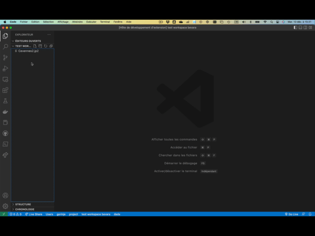

# Bevara vscode editor

This is yet a small extension to help debugging decoders from Bevara products.

## Demo

## Compilation instructions
Make sure you have [Node.js](https://nodejs.org/) installed. Then run:
`npm install -g @vscode/vsce`

### Package the extension
Run : `vsce package`

### Publish the extension
Run : `vsce publish`